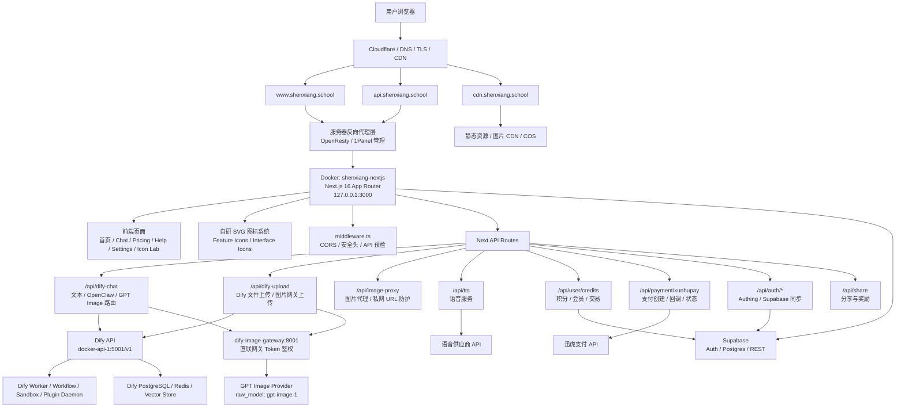

# 项目架构地图

适用项目：`ai-essay-editor` / 沈翔智学。

本文档负责回答“系统长什么样、请求往哪里走、关键边界在哪里”。流程要求看 `docs/CODEX-SKILL-SOP.md`，线上故障处理看 `docs/RUNBOOK.md`。

## 一句话架构

沈翔智学是一个运行在 Docker 自托管环境中的 Next.js 16 App Router 应用，通过 OpenResty / 1Panel 管理的反向代理暴露 `shenxiang.school` 系列域名；应用侧负责页面、API Routes、鉴权同步、支付/积分/会员、Dify 工作流调用、图片代理、TTS 和分享奖励；外部依赖包括 Cloudflare、COS/CDN、Dify、Supabase、迅虎支付、语音供应商和 GPT Image Provider。

## 架构图

## 主要边界

### 入口层

- `www.shenxiang.school`：用户访问的主站页面。
- `api.shenxiang.school`：API 入口。
- `cdn.shenxiang.school`：静态资源、图片 CDN、COS 访问入口。
- Cloudflare 负责 DNS、TLS 和 CDN。
- OpenResty / 1Panel 反向代理负责把请求转发到 Docker 内的 Next.js 服务。

### Next.js 应用层

- 容器：`shenxiang-nextjs`
- 框架：Next.js 16 App Router + TypeScript
- 监听：`127.0.0.1:3000`
- 页面：`app/**/page.tsx`
- 组件：`components/**`
- 通用逻辑：`lib/**`
- 中间件：`middleware.ts`

### API Routes 层

关键 API 按职责分组：

- 聊天与 Dify：`/api/dify-chat`
- 上传：`/api/dify-upload`
- 图片代理：`/api/image-proxy`
- 语音：`/api/tts`
- 用户权益：`/api/user/credits`
- 支付：`/api/payment/xunhupay`
- 鉴权同步：`/api/auth/*`
- 分享奖励：`/api/share`

改动 API 时必须同时检查鉴权、输入校验、错误消息、速率限制、日志敏感信息和测试覆盖。

### AI / Dify 层

- Dify API：`docker-api-1:5001/v1`
- Dify 依赖：Worker、Workflow、Sandbox、Plugin Daemon、PostgreSQL、Redis、Vector Store。
- 图片直联网关：`dify-image-gateway:8001`，使用 Token 鉴权。
- GPT Image Provider：`raw_model: gpt-image-1`

常见风险：

- Base URL 重复拼接 `/v1`。
- 容器间通信误用 `127.0.0.1`。
- 文件上传路径绕过网关校验。
- 流式输出被后端或前端改成一次性返回。

### 数据与身份层

- Supabase 承担 Auth、Postgres 和 REST。
- Authing 与 Supabase 之间存在同步逻辑。
- 用户权益相关数据包括积分、会员、交易流水、订单状态和分享奖励。

改动这些模块时必须优先查看：

- `lib/supabase/**`
- `lib/auth-user.ts`
- `lib/auth/**`
- `lib/billing.ts`
- `lib/permissions.ts`
- `lib/rate-limit.ts`
- `app/api/user/**`
- `app/api/auth/**`

### 支付层

- 支付供应商：迅虎支付 API。
- 关键动作：支付创建、支付回调、订单状态、积分/会员到账。
- 支付回调不得削弱签名校验，不得通过前端参数直接授予权益。

改动支付相关逻辑时必须调用 `security`、`vibe-security-threat-model`、`backend`、`qa`。

### 静态资源 / 图片层

- CDN/COS 负责静态资源和图片。
- `/api/image-proxy` 负责图片代理和私网 URL 防护。
- OpenClaw/GPT Image 相关图片链路必须保持 Token 鉴权和私网地址保护。

## 关键代码地图

| 区域 | 位置 | 说明 |
|---|---|---|
| 页面 | `app/**/page.tsx` | App Router 页面 |
| API | `app/api/**/route.ts` | 后端入口 |
| 聊天 UI | `components/chat/**` | 聊天、模型、渲染、工作流可视化 |
| 通用组件 | `components/ui/**` | UI 基础组件 |
| 首页/营销页 | `components/home/**` | 首页模块 |
| 图标系统 | `components/icons/**` | 自研 SVG 图标 |
| 鉴权 | `lib/auth-user.ts`, `lib/auth/**`, `middleware.ts` | 用户身份与中间件 |
| Dify | `lib/dify-workflow-client.ts`, `lib/internal-dify-fetch.ts` | Dify 调用 |
| 支付/权益 | `lib/billing.ts`, `lib/stripe.ts`, `lib/wechat-pay.ts`, `lib/xunhupay.ts` | 支付和会员权益 |
| Supabase | `lib/supabase/**`, `lib/supabase.ts` | Supabase 客户端/服务端 |
| 媒体代理 | `lib/openclaw-media.ts`, `lib/openclaw-media-server.ts` | OpenClaw 媒体 |
| 语音 | `lib/voice-tts-request.ts`, `services/voice-gateway/**` | TTS/STT 相关 |
| 独立服务 | `services/**` | essay-ai-suite、word-card-api、voice-gateway |
| 测试 | `__tests__/**` | Jest 测试 |
| 运维 | `docs/RUNBOOK.md`, `docs/OPERATIONS.md`, `docs/MONITORING.md` | 线上和监控 |

## 改动前读图规则

- 改 UI：先读 `docs/CODEX-SKILL-SOP.md`、本文件、目标页面和目标组件。
- 改 API：先读本文件、目标 route、相关 `lib/**`、相关测试。
- 改支付/积分/会员：先读本文件、SOP 安全红线、支付/权益文件和相关测试。
- 改 Dify/图片/上传：先读本文件、`lib/dify-*`、相关 API route、图片代理和上传测试。
- 改部署/容器/1Panel：先读本文件、`docs/RUNBOOK.md`、`docs/OPERATIONS.md`、`docs/DEPLOY-SCRIPT.md`，且不得默认操作生产基础设施。
