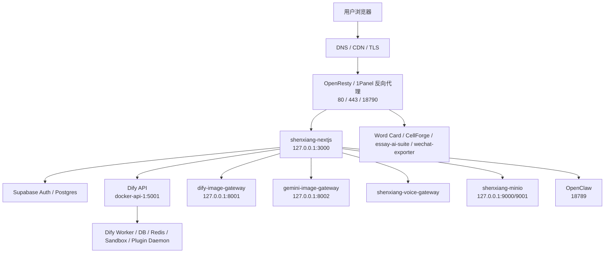

# 服务器服务拓扑与端口矩阵

更新时间：2026-05-14  
服务器：`43.154.111.156`  
生产项目目录：`/data/ai-essay-editor`  
主站域名：`shenxiang.school`

本文档用于交接、故障排查和后续端口治理。所有端口和容器状态都应以服务器实时审计为准；变更前先运行 `scripts/server-audit.sh` 生成快照。

## 总体拓扑



## 服务分级

| 分级 | 服务 / 容器 | 作用 | 当前处理策略 |
|---|---|---|---|
| 生产核心 | `shenxiang-nextjs`, `shenxiang-openresty` | 主站页面、API、反向代理入口 | 只能按发布流程重建；禁止直接删除 |
| 生产依赖 | Dify API/Worker/Web/DB/Redis/Sandbox/Weaviate/Plugin Daemon | 聊天、工作流、插件执行 | 保留；端口收敛前先确认 Dify 调用链 |
| 生产依赖 | `dify-image-gateway`, `gemini-image-gateway`, `shenxiang-voice-gateway` | 图片与语音网关 | 保留；优先内网或本机绑定 |
| 生产依赖 | `shenxiang-minio`, `shenxiang-redis` | 对象存储、缓存 | 保留；禁止清理数据卷 |
| 外部业务 | `1Panel-openclaw-z5b8` | OpenClaw 生成/多媒体能力 | 保留；端口治理需先确认用户访问路径 |
| 外部业务 | `word-card-api-*`, `1Panel-localessay-ai-suite-*`, `shenxiang-cellforge-*` | 独立业务或实验应用 | 先列入清单，不直接删除 |
| 候选复核 | `gemini_app`, `gemini_nginx`, `gemini_postgres`, `gemini_redis`, `wechat-exporter`, `codex-skill-gateway*` | 可能是历史服务、实验服务或运维服务 | 需要用日志、反代配置、端口访问记录交叉确认 |

## 当前重点端口

| 端口 | 绑定 | 已知服务 | 风险判断 | 建议 |
|---:|---|---|---|---|
| 80 / 443 | `0.0.0.0` | OpenResty HTTPS 入口 | 必需公网 | 保留 |
| 22 | `0.0.0.0` | SSH | 必需管理入口 | 保留，建议密钥登录和限制来源 |
| 20241 | `0.0.0.0` | 1Panel | 管理面高风险 | 确认是否需要公网，优先限制来源 IP |
| 18789 | `0.0.0.0` | OpenClaw | 业务入口或反代目标 | 保留前先确认访问路径 |
| 18790 | `0.0.0.0` | OpenResty/1Panel | 反代入口 | 确认用途后保留或限制 |
| 8000 / 8080 | `0.0.0.0` | Gemini 独立栈 | 可能不应公网暴露 | 核对反代和真实访问后收敛 |
| 8089 | `0.0.0.0` | wechat-exporter | 候选复核 | 确认无人访问再下线或内网化 |
| 3011 | `0.0.0.0` | Word Card API | 候选复核 | 如仅内部调用，改本机绑定或防火墙限制 |
| 3100 | `0.0.0.0` | essay-ai-suite | 候选复核 | 确认是否独立公网服务 |
| 5003 | `0.0.0.0` | Dify Plugin Daemon | 不建议公网暴露 | 优先改为 Docker 内网或防火墙限制 |
| 15433 / 16380 | `0.0.0.0` | Word Card Postgres/Redis | 高风险数据端口 | 优先限制到本机或内网，变更前备份并验证依赖 |
| 3000 | `127.0.0.1` | Next.js | 正确，本机反代 | 保持 |
| 8001 / 8002 | `127.0.0.1` | 图片网关 | 正确，本机调用 | 保持 |
| 9000 / 9001 | `127.0.0.1` | MinIO | 正确，本机访问 | 保持 |
| 5432 | `127.0.0.1` | 本地 Postgres | 正确，本机访问 | 保持 |

## 数据和配置边界

禁止默认删除或覆盖：

- `/opt/1panel/**`
- OpenResty/Nginx 配置和证书
- Docker volumes
- Postgres、Redis、MinIO、OpenClaw、Dify 数据目录
- `/data/ai-essay-editor/.env.production`
- 用户上传资源、对象存储数据、支付和积分相关数据

## 日常核查命令

```bash
cd /data/ai-essay-editor
bash scripts/server-audit.sh | tee "/data/server-audit-$(date +%F-%H%M).log"
docker ps --format 'table {{.Names}}\t{{.Status}}\t{{.Ports}}'
ss -lntp
curl -fsS http://127.0.0.1:3000/api/health
curl -fsS https://shenxiang.school/api/health
```

## 端口治理顺序

1. 记录当前端口、容器、反代配置、访问日志。
2. 给每个公网端口标记“用户直连”“OpenResty 反代”“内部调用”“未知”。
3. 对未知端口先观察 3-7 天访问日志，不直接关闭。
4. 数据库、Redis、Plugin Daemon 等高风险端口优先改为本机绑定或防火墙限制。
5. 每次只改一个端口组，改后验证主站、Dify、图片网关、OpenClaw 和后台。
